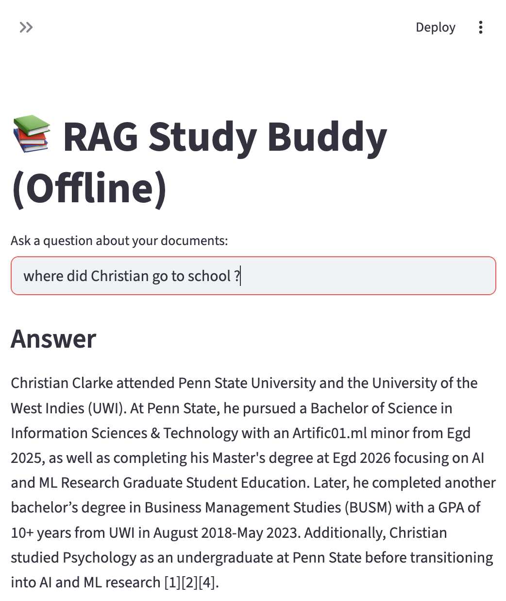

# Offline RAG Study Buddy

An offline Retrieval-Augmented Generation (RAG) chatbot that answers questions from local documents with citations.

## Features
- Local document ingestion (PDF, TXT, MD)
- Text chunking + embeddings
- FAISS vector search
- Local LLM generation via Ollama
- Streamlit web interface
- Source citations for grounded answers

## Tech Stack
- Python
- Streamlit
- FAISS
- SentenceTransformers
- Ollama (local LLM)

## How to Run
```bash
python3 -m venv .venv
source .venv/bin/activate
pip install -r requirements.txt
ollama pull phi3
python3 -m rag.build_index
streamlit run app/main.py

## Demo


